# YOLO CAM Attribution 실험 프레임워크

YOLO 객체탐지 모델(`yolo11n.pt`)로 **사람(person) 검출**을 하고, 검출 결과를 바탕으로 **설명 가능성(attribution)** 실험을 수행한다.  
상위 폴더는 **EigenCAM**(기본) 파이프라인, 하위 **`grad_cam/`** 은 동일 실험을 **GradCAM**으로 재현하는 병렬 트랙이다.

---

## 목차

1. [실험 개요](#실험-개요)
2. [폴더 구조](#폴더-구조)
3. [실행 순서](#실행-순서)
4. [Grad-CAM 서브프로젝트 (`grad_cam/`) 분석](#grad-cam-서브프로젝트-grad_cam-분석)
5. [EigenCAM vs GradCAM 트랙 비교](#eigencam-vs-gradcam-트랙-비교)
6. [모델·지표·개입](#모델지표개입)
7. [실패 은행 기반 결과 분석](#실패-은행-기반-결과-분석)
8. [GitHub에 올리기](#github에-올리기)

---

## 실험 개요

| 단계 | 스크립트 | 설명 |
|------|----------|------|
| Task 1 | `comparison_summary.md` | jacobgil vs kazuto Grad-CAM 구현 비교 요약 |
| Task 2 | `01_build_failure_bank.py` | 데이터셋에서 이미지 선별 → `test_images/`, `failure_bank/` |
| Task 3 | `02_yolo_cam.py` | 검출 + CAM 히트맵 (`cam_results/`) |
| Task 4 | `03_cam_metrics.py` | Inside Ratio, Focus Score, 개입 연동 지표 (`metrics_results/`) |
| Task 5 | `04_intervention.py` | 배경 blur / 객체 외부 마스킹 등 (`intervention_results/`) |

**`grad_cam/`** 안에는 위와 **동일 단계**를 GradCAM 전용으로 둔 스크립트(`config.py`, `01`…`04`)가 있다. `test_images/`만 상위와 공유하고, `failure_bank`·CAM·개입·지표 결과는 `grad_cam/` 아래에 따로 쌓인다.

---

## 폴더 구조

```
yolo_cam_attribution/
├── README.md                 # 본 문서
├── requirements.txt
├── comparison_summary.md
├── config.py
├── 01_build_failure_bank.py
├── 02_yolo_cam.py            # 기본 CAM: EigenCAM (--cam-method 로 변경 가능)
├── 03_cam_metrics.py
├── 04_intervention.py
├── test_images/              # 01 실행 시 생성 (gitignore 권장)
├── docs/readme_assets/       # README용 예시 이미지 (GradCAM 트랙 스냅샷)
├── failure_bank/
├── cam_results/
├── metrics_results/
├── intervention_results/
└── grad_cam/                 # GradCAM 전용 트랙
    ├── README.md
    ├── config.py
    ├── 01_build_failure_bank.py
    ├── 02_yolo_cam.py       # GradCAM 고정
    ├── 03_cam_metrics.py
    ├── 04_intervention.py
    ├── failure_bank/
    ├── cam_results/
    ├── metrics_results/
    └── intervention_results/
```

---

## 실행 순서

### 상위 (EigenCAM 기본)

```bash
cd yolo_cam_attribution
pip install -r requirements.txt
# yolo11n.pt 를 이 폴더에 두거나 Ultralytics 가 받아오도록 둠

python 01_build_failure_bank.py
python 02_yolo_cam.py                    # 기본 eigencam
python 04_intervention.py
python 03_cam_metrics.py
```

### `grad_cam/` (GradCAM)

```bash
cd yolo_cam_attribution/grad_cam
pip install -r requirements.txt

python 01_build_failure_bank.py          # grad_cam/failure_bank/ + 상위 test_images
python 02_yolo_cam.py
python 04_intervention.py
python 03_cam_metrics.py
```

---

## Grad-CAM 서브프로젝트 (`grad_cam/`) 분석

### 왜 별도 폴더인가

Ultralytics YOLO의 **기본 `02_yolo_cam.py`는 EigenCAM을 기본값**으로 둔다. EigenCAM은 그래디언트 없이 활성화 맵에 PCA 성격의 투영을 쓰기 때문에, **NMS·검출 헤드가 미분하기 어려운 구조**에서도 비교적 안정적으로 동작한다.  
반면 **GradCAM**은 출력에 대해 **역전파**가 필요하므로, 그대로 전체 `DetectionModel.forward()`를 쓰면 다음 문제가 생긴다.

1. **Detect 헤드의 inference 전용 텐서**  
   최신 Ultralytics 검출 헤드는 `Inference tensors cannot be saved for backward` 류의 오류를 유발할 수 있다.
2. **`targets=None` 가정**  
   `pytorch-grad-cam`의 GradCAM은 분류 로짓 `[B, num_classes]` 에 가까운 출력을 가정할 때 `targets=None` 처리가 자연스럽다. 잘린 특징 맵 `[B, C, H, W]` 만 있으면 **스칼라 loss를 직접 정의**해야 한다.

### 이 레포에서 쓰는 해결책

| 요소 | 역할 |
|------|------|
| **`YOLOWrapper`** | `DetectionModel.model` 층을 **Ultralytics와 동일한 `m.f` 연결 규칙**으로 순전파하되, **마지막 Detect 모듈은 실행하지 않는다**. 그래프가 헤드 이전에서 끊겨 역전파가 가능해진다. |
| **`TotalSumTarget`** | 잘린 출력 텐서에 대해 `output.float().sum()` 으로 **스칼라 loss**를 만들어 GradCAM의 `backward` 경로를 통과시킨다. (특정 클래스 "사람" 로짓과 동일하지 않음 — **해석은 부분적**.) |
| **`input_tensor.requires_grad_(True)` + `torch.enable_grad()`** | 입력·파라미터 쪽 그래디언트 경로를 명시적으로 연다. |
| **타깃 레이어** | 상위와 동일하게 `model.model[-2]` (Detect 직전 블록). |

### 해석 시 주의

- GradCAM 히트맵은 **"잘린 특징 + 합(sum) loss"** 에 대한 민감도에 가깝다. **실제 person confidence나 박스 회귀에 대한 클래스별 Grad-CAM**과는 다르다.
- 검출 박스는 여전히 **`YOLO.predict()`** 로 얻으며, CAM은 **별도 640×640 입력 경로**로 계산한다(상위 스크립트와 동일한 설계). 레터박스와의 미세 불일치 가능성은 문서화만 해둔다.

---

## EigenCAM vs GradCAM 트랙 비교

| 항목 | 상위 `02_yolo_cam.py` | `grad_cam/02_yolo_cam.py` |
|------|------------------------|---------------------------|
| 기본 CAM | EigenCAM (`--cam-method`로 GradCAM 등 선택 가능) | GradCAM 고정 |
| Wrapper | tuple 첫 요소만 반환하는 얕은 래퍼 | Detect 생략 + `m.f` 그래프 순전파 |
| Loss / target | EigenCAM은 해당 제약 완화 | `TotalSumTarget` (출력 합) |
| 산출물 메타 | (선택) `cam_method` 없을 수 있음 | `metadata.json`에 `cam_method: gradcam` |
| Failure bank | `failure_bank/` | `grad_cam/failure_bank/` (동일 CSV 스키마) |

두 트랙 모두 **M1~M4 지표·개입 JSON 스키마**는 맞추어 두었고, `grad_cam`의 `comparison.json`에는 `cam_method` 필드가 추가되며 `03_cam_metrics.py`가 로드 시 제거한다.

---

## 모델·지표·개입

- **검출 모델:** `yolo11n.pt` (COCO pretrained, **class 0 = person** 만 사용)
- **CAM 라이브러리:** [`jacobgil/pytorch-grad-cam`](https://github.com/jacobgil/pytorch-grad-cam)
- **Target layer:** `yolo.model.model[-2]`

### 정량 지표

| 지표 | 의미 |
|------|------|
| M1 Inside Ratio | bbox 내부 CAM 비율 |
| M2 Outside Ratio | 1 − M1 |
| M3 Confidence Drop | 개입 전후 max confidence 차이 (`04` 연동) |
| M4 Focus Score | `max(cam) / mean(cam)` |

### 개입 (`04`)

`bg_blur`, `obj_mask`, `obj_crop`, `bg_replace` 등 — 상위와 `grad_cam` 동일 옵션.

### Failure bank 카테고리

`easy_success`, `hard_success`, `missed_detection`, `small_object` 등 — 규칙은 `01_build_failure_bank.py` 내 `classify_image` 참고.

---

## 실패 은행 기반 결과 분석

아래는 `01_build_failure_bank.py`를 **시드 42, 50장, `conf=0.25`** 조건으로 돌렸을 때 생성된 `failure_bank/failure_bank.csv`를 바탕으로 한 해석이다. (이미지를 다시 뽑으면 비율은 달라질 수 있다.)

### 분포 요약

| 카테고리 | 장수 | 비율(50장 기준) | 자동 분류 기준 요약 |
|----------|------|-----------------|---------------------|
| `easy_success` | 38 | 76% | 사람 검출됨, **max confidence ≥ 0.7**, bbox 최소 면적 비율 ≥ 2% |
| `hard_success` | 5 | 10% | 검출은 됐으나 **0.25 ≤ max conf < 0.7** |
| `small_object` | 6 | 12% | 검출은 됐으나 bbox 중 하나라도 이미지 대비 면적 비율 **< 2%** |
| `missed_detection` | 1 | 2% | person 클래스 **검출 0건** (`conf` 임계값 미만) |

데이터는 **헬멧 2클래스 분류용 현장 이미지**에서 샘플링되었고, 라벨은 **COCO person 검출기(yolo11n)** 관점에서만 자동 판정된다.

---

### 1. Easy Success (쉬운 케이스)

> `image1219.jpg` — max conf ≈ **0.95**, 단일 인물, 상반신 명확

| 검출 결과 | GradCAM 오버레이 |
|:---------:|:----------------:|
| 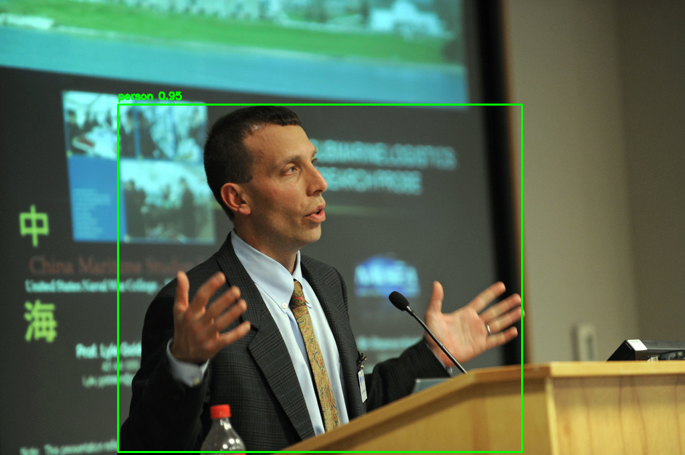 | 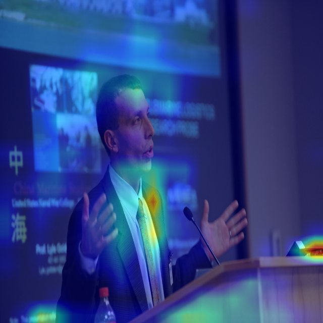 |

- 대부분 max confidence가 **0.82~0.95** 구간에 몰려 있어, 특징이 "전형적인 사람" 형태로 잡힌 프레임이다.
- 객체가 프레임에서 충분히 크고(bbox 면적 ≥ 2%), **단일·소수 인물** 중심이다.
- GradCAM 히트맵이 **인물의 상체·얼굴 주변에 집중**되어 있어, 모델이 어디를 보고 판단했는지가 직관적으로 일치한다.

---

### 2. Hard Success (어렵지만 검출된 케이스)

> `image233.jpg` — max conf ≈ **0.32**, 현장 작업자, 안전조끼 착용

| 검출 결과 | GradCAM 오버레이 |
|:---------:|:----------------:|
| 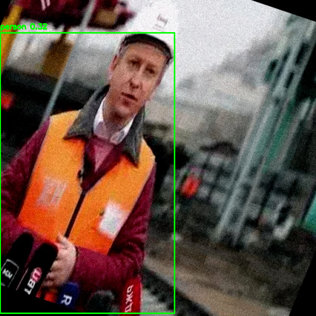 | 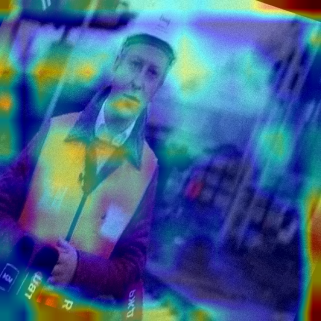 |

- 신뢰도만 낮을 뿐 박스는 있다: `image233`(0.32), `image528`(0.38), `image573`(0.51) 등.
- GradCAM이 **인물 영역 바깥(배경, 장비, 텍스트 등)에까지 넓게 분산**된다. 모델이 확신이 부족해 주변 문맥까지 끌어쓰는 패턴이 시각적으로 확인된다.
- 해석 후보:
  - **자세·가림·조명**으로 특징이 약해 logits가 불확실한 경우
  - **박스가 이미지 대부분을 덮는 근접/과대 검출** — 맥락이 애매한 경우
  - **헬멧·안전조끼** 등 COCO person 학습 분포와 어긋나 **얼굴·윤곽 신호가 약한** 현장 이미지

> `image573.jpg` — max conf ≈ **0.51**, 중복 박스 2개, 가림(occlusion) 발생

| 검출 결과 | GradCAM 오버레이 |
|:---------:|:----------------:|
| 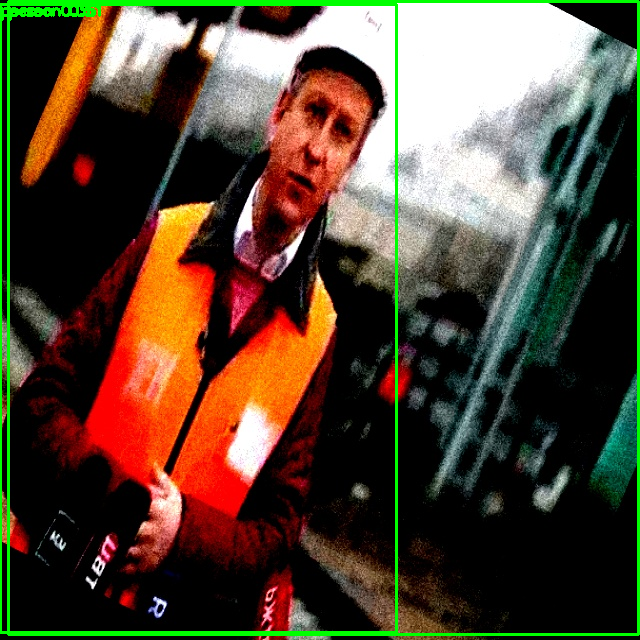 | 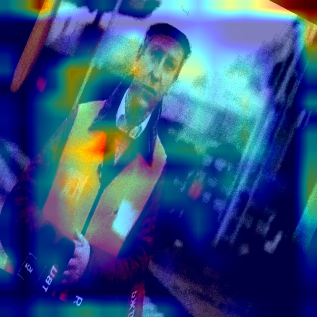 |

- 동일 인물에 두 개의 겹치는 박스가 생성되었고, 두 박스 모두 confidence가 0.51 이하로 낮다.
- GradCAM 역시 활성화가 **인물 주변으로 넓게 퍼져** 있으며, 어깨~가슴 영역에만 약한 핫스팟이 보인다.

---

### 3. Small Object (작은 객체 케이스)

> `image1024.jpeg` — max conf ≈ **0.86** 이지만, 좌측 끝 작은 bbox 면적 비율 **1.15% < 2%**

| 검출 결과 | GradCAM 오버레이 |
|:---------:|:----------------:|
| 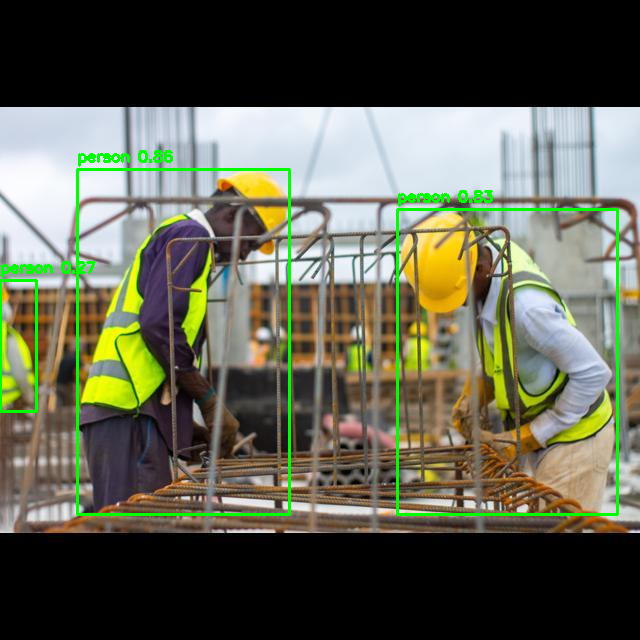 | 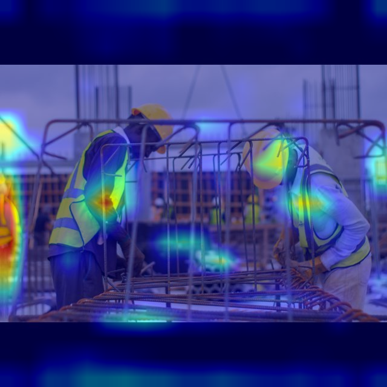 |

- max confidence가 높아도 **최소 면적 비율** 때문에 `easy_success`가 아니다. "검출 품질"과 "난이도(크기)"를 분리해 태깅한 것이다.
- GradCAM은 두 명의 큰 작업자에게 집중하되, 화면 좌측 끝의 작은 인물에 대해서는 **활성화가 거의 없다**. 작은 객체는 feature map 해상도 상 CAM으로 설명이 어려운 한계를 보여준다.

> `image1121.jpg` — **16명** 군중, 다수 bbox가 이미지 대비 면적 < 2%

| 검출 결과 | GradCAM 오버레이 |
|:---------:|:----------------:|
| 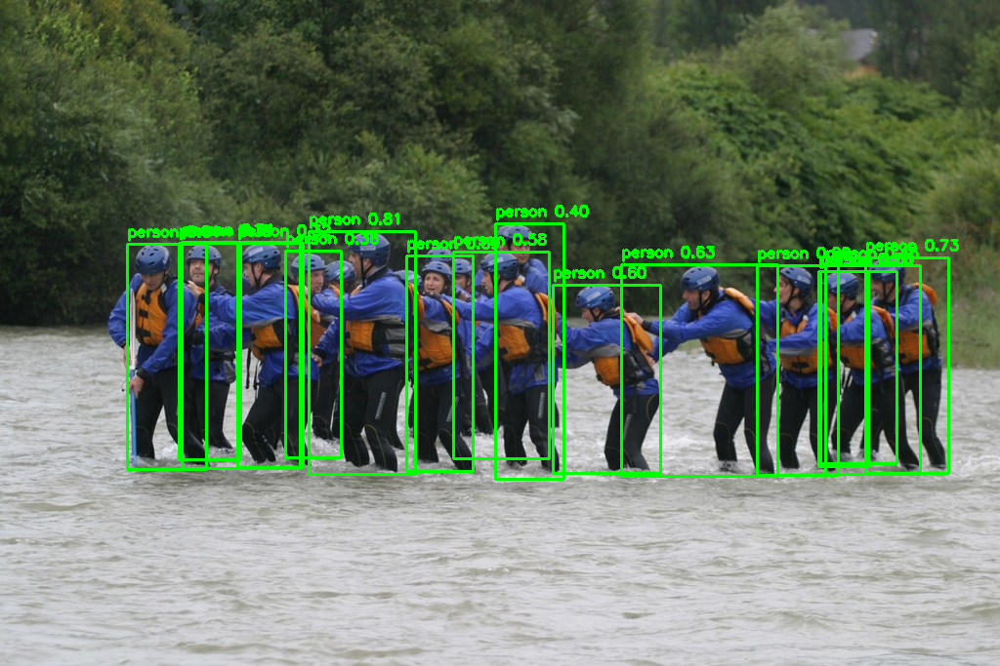 | 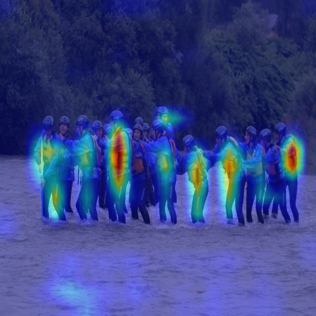 |

- 16명이 밀집된 군중 장면에서 개별 bbox는 작지만, GradCAM은 **군중 전체를 하나의 클러스터**로 인식하는 경향이 보인다.
- 개별 인물에 대한 세밀한 attribution 분리는 이루어지지 않으며, 이는 Feature-level CAM의 해상도 한계이다.

---

### 4. Missed Detection (검출 실패 케이스)

> `image751.jpg` — person 검출 **0건** (conf 0.25 임계값 미달)

| 원본 + 라벨 (검출 없음) |
|:-----------------------:|
| 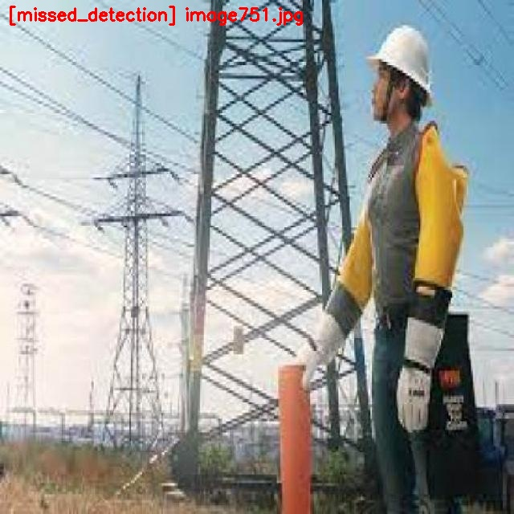 |

- **사람이 분명히 존재하지만 YOLO가 검출하지 못한 실패 사례**이다.
- 실패 원인 분석:
  - **복잡한 배경 구조물**: 송전탑의 격자 구조가 인물의 윤곽선과 겹쳐, backbone이 사람 특징을 추출하기 어려웠을 수 있다.
  - **산업 장비와의 혼동**: 안전조끼·하네스 등 장비가 인물 실루엣을 비전형적으로 만들어, COCO 학습 분포와 거리가 발생했을 가능성이 있다.
  - **측면 자세**: 인물이 정면이 아닌 측면을 향하고 있어 얼굴/상체 특징이 약화되었다.
- CAM 파이프라인(`02`)은 검출이 없으면 해당 이미지를 **스킵**하므로, attribution 분석에서 **공백**이 된다. 이런 사례에서는 전체 이미지에 대한 전역 CAM을 별도로 생성해야 "왜 못 찾았는가"를 분석할 수 있으며, 이는 현재 프레임워크의 한계이다.

---

### 5. 성공·실패와 CAM 해석 종합

| 카테고리 | CAM 해석 특성 | 개입 실험 활용 |
|----------|---------------|---------------|
| **easy_success** | CAM이 bbox 내부에 집중 → "설명과 검출이 정합" | baseline 비교군 |
| **hard_success** | CAM이 bbox 외부로 분산 → 배경 의존 패턴 | 배경 blur 시 conf 변화(M3)가 큰지 검증 |
| **small_object** | 작은 bbox에 대한 CAM 해상도 부족 | Inside Ratio(M1)가 낮을 것으로 예상 |
| **missed_detection** | CAM 생성 불가 (검출 자체가 없음) | 한계 사례, 데이터 보강·임계값·특화 학습 논의용 |

> **핵심 관찰**: confidence가 낮아질수록 GradCAM 활성화가 인물 바깥으로 퍼지는 경향이 명확하다. 이는 모델이 확신이 부족할 때 **주변 환경적 맥락(Context)**에 더 의존한다는 해석을 뒷받침한다.

---

## GitHub에 올리기

이 디렉터리는 **`.gitignore`** 로 대용량·재현 가능 산출물(`test_images/`, `cam_results/`, `*.pt` 등)을 제외하도록 해 두었다. 저장소에는 **코드·README·`docs/readme_assets/` 예시 이미지**가 포함되며, 전체 결과는 스크립트로 재생성한다.

```bash
cd yolo_cam_attribution
git init
git add .
git commit -m "Add YOLO CAM attribution framework with grad_cam GradCAM track"

# GitHub에서 빈 저장소 생성 후
git remote add origin https://github.com/<USER>/<REPO>.git
git branch -M main
git push -u origin main
```

GitHub CLI 사용 시:

```bash
gh repo create <REPO> --public --source=. --remote=origin --push
```

(로컬에서 `yolo_cam_attribution`을 루트로 쓰려면 위 `cd` 후 `git init` 하면 된다. 상위 `project` 전체를 올리려면 루트와 `.gitignore`를 따로 조정하면 된다.)

---

## 라이선스·인용

- YOLO: Ultralytics 라이선스 정책을 따른다.
- Grad-CAM: Selvaraju et al., *Grad-CAM: Visual Explanations from Deep Networks via Gradient-based Localization*, ICCV 2017.
- EigenCAM: `pytorch-grad-cam` 문서 및 구현 참고.
